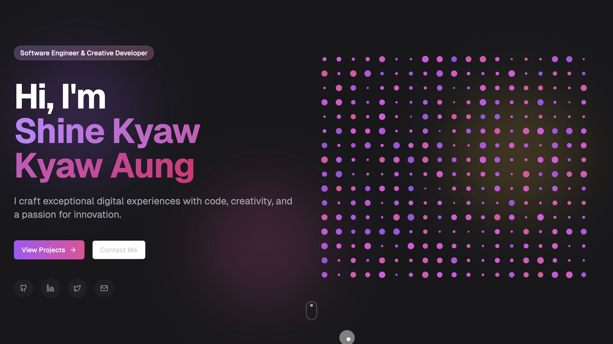

# Nayka Portfolio

Personal portfolio website for **Rose-Nayka Fleuridor** showcasing projects, skills, education, and contact details.



## Stack

- Next.js (App Router)
- React
- Tailwind CSS
- TypeScript

## Features

- Responsive one-page portfolio layout
- Animated hero and section transitions
- Skills, education, and awards sections
- Featured projects section
- Contact section with social links and email access
- Resume download from `/public/Rose-Fleuridor-Resume.pdf`

## Run Locally

1. Clone the repository:
   ```bash
   git clone https://github.com/Rosefleuridor/Nayka-Portfolio.git
   ```
2. Go to the project folder:
   ```bash
   cd Nayka-Portfolio
   ```
3. Install dependencies:
   ```bash
   npm install
   ```
4. Start the development server:
   ```bash
   npm run dev
   ```
5. Open [http://localhost:3000](http://localhost:3000)

## Build

```bash
npm run build
```

## Repository

[Nayka-Portfolio](https://github.com/Rosefleuridor/Nayka-Portfolio)
